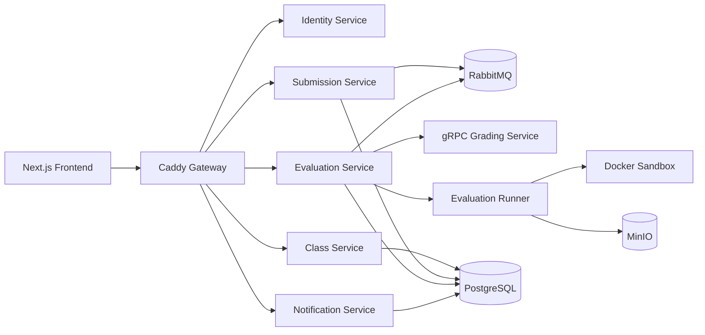

<div align="center">
  <br />
  <h1>🎓 EvalCore — Automated Grading System</h1>
  <p>
    Distributed .NET-based automated grading platform for programming assignments with sandboxed Docker evaluation, RabbitMQ async processing, gRPC scoring, weighted rubrics, notifications, and a live grading monitor.
  </p>
  <p>
    
    
    
    
    
    
  </p>
  <p>
    
    
    
    
    
  </p>
</div>

---

## 📑 Table of Contents

- [🌟 About the Project](#-about-the-project)
  - [✨ Key Features](#-key-features)
  - [🛠️ Built With](#️-built-with)
- [🏗️ Architecture](#️-architecture)
  - [Service Responsibilities](#service-responsibilities)
  - [Event and Background Processing](#event-and-background-processing)
  - [gRPC Scoring Flow](#grpc-scoring-flow)
- [🚀 Getting Started](#-getting-started)
  - [Prerequisites](#prerequisites)
  - [Environment Setup](#environment-setup)
  - [Docker Compose Guide](#docker-compose-guide)
  - [Verify URLs](#verify-urls)
- [📖 API Documentation](#-api-documentation)
- [🧪 Usage and Demo](#-usage-and-demo)
- [☁️ Deployment](#️-deployment)
- [👥 Team Member Responsibilities](#-team-member-responsibilities)
- [🗺️ Roadmap](#️-roadmap)
- [📄 License](#-license)
- [📧 Contact](#-contact)

---

## 🌟 About the Project

**EvalCore** is a distributed platform for managing programming labs and automatically grading student submissions. Lecturers publish lab requirements and Postman collections, students upload ZIP projects through presigned object-storage URLs, and background workers evaluate the projects in isolated Docker Compose sandboxes.

The platform combines REST APIs for user-facing workflows, RabbitMQ for reliable asynchronous processing, and an internal gRPC service for synchronous score calculation. Newman assertion results are evaluated against either an equal-assertion policy or a lecturer-defined weighted rubric, persisted for reporting, and surfaced through notifications and the lecturer live monitor.

### ✨ Key Features

- **Lecturer class and lab management** — create classes, enroll students, publish labs, and configure grading criteria.
- **Secure lab assets** — role-aware access to requirements and private Postman collections.
- **Student ZIP submission** — validate and track one or more programming-assignment attempts.
- **Presigned MinIO upload** — upload lab and submission assets directly to S3-compatible storage.
- **RabbitMQ event-driven evaluation** — accept submissions quickly and process them asynchronously.
- **Docker sandbox runner** — build and start untrusted projects in bounded, isolated Compose projects.
- **Newman/Postman API testing** — execute real HTTP assertions against the submitted application.
- **Weighted rubric scoring** — map assertions to lecturer-defined criteria and score out of a configurable maximum.
- **gRPC Grading Service** — centralize equal-assertion and weighted-rubric score calculation.
- **Notification center and email delivery** — store in-app notifications and optionally deliver results through SMTP.
- **Live grading monitor** — show queue, running, passed, failed, and infrastructure-error states.
- **100-student mixed demo** — exercise realistic passing, assertion-failure, build, readiness, and Compose-error variants.
- **Docker and cloud deployment** — run locally, on a VPS, or behind a managed tunnel and hosted frontend.

### 🛠️ Built With

**Frontend**

- [Next.js](https://nextjs.org/) and [React](https://react.dev/)
- [TypeScript](https://www.typescriptlang.org/)
- [Tailwind CSS](https://tailwindcss.com/)
- [Bun](https://bun.sh/)

**Backend**

- [ASP.NET Core .NET 8](https://dotnet.microsoft.com/)
- [Entity Framework Core](https://learn.microsoft.com/ef/core/) and PostgreSQL
- JWT Bearer authentication and role-based authorization
- [gRPC](https://grpc.io/) with Protocol Buffers
- [RabbitMQ](https://www.rabbitmq.com/)
- [MinIO](https://min.io/) / S3-compatible object storage
- [MailKit](https://github.com/jstedfast/MailKit) and configurable SMTP delivery

**DevOps and Delivery**

- Docker and Docker Compose
- Caddy API gateway
- DockerHub service images
- GitHub Actions CI/CD
- Vercel frontend deployment placeholder
- Cloudflare Tunnel / VPS deployment placeholder
- Dozzle container log viewer

---

## 🏗️ Architecture



Replace the placeholder below with the final deployed architecture export before submission:


### Service Responsibilities

| Service | Responsibility |
|---|---|
| Identity Service | Registration, login, JWT issuance, roles, profiles, and trusted internal user lookup. |
| Class Service | Classes, membership, labs, secure lab assets, and weighted-rubric configuration. |
| Submission Service | Submission lifecycle, presigned ZIP uploads, asset completion, and `SubmissionSubmitted` publication. |
| Evaluation Service | Evaluation REST API, durable evaluation records, reports, outbox publication, and live-monitor data. |
| Evaluation Runner | RabbitMQ consumption, bounded concurrency, Docker sandbox orchestration, Newman execution, and cleanup. |
| Grading gRPC Service | Synchronous calculation for equal-assertion and weighted-rubric scoring policies. |
| Notification Service | `EvaluationCompleted` consumption, notification inbox persistence, and optional SMTP delivery. |
| Frontend | Student and lecturer workflows, rubric editing, notifications, result views, and live grading monitor. |
| Ops | Compose orchestration, gateway routing, data services, Swagger portal, smoke tests, and deployment configuration. |

### Event and Background Processing

1. Submission Service commits a submitted ZIP and publishes **`SubmissionSubmitted`** through its durable outbox to RabbitMQ.
2. The Evaluation consumer creates durable evaluation work; the Evaluation Runner claims work, executes the sandbox, and stores the result.
3. Evaluation publishes **`EvaluationCompleted`** through RabbitMQ after the final report is persisted.
4. Notification consumes that event, creates the student's **notification**, and records or performs email delivery.

The two principal background jobs are the **Evaluation consumer/runner** and the **Notification consumer/email-delivery worker**. RabbitMQ is the selected message broker for lifecycle events; it is not replaced by gRPC.

### gRPC Scoring Flow

After Newman completes, Evaluation sends the assertion results and immutable rubric snapshot to the internal Grading Service. Grading returns the scoring mode, earned and maximum scores, pass state, assertion totals, criterion breakdown, and unmatched assertions. Evaluation persists that response in its report, REST API, and live monitor.

| Contract item | Value |
|---|---|
| Proto file | `../prn232-grading-service/src/Grading.Api/Protos/grading.proto` |
| Proto package | `evalcore.grading.v1` |
| Service | `GradingScorer` |
| Method | `CalculateScore` |
| Input | Scoring-mode hint, Newman assertion results, and rubric criteria snapshot. |
| Output | Final score, maximum, percentage, pass state, assertion totals, criterion scores, and unmatched assertions. |
| Internal endpoint | `http://grading-service:5007` inside the Compose network. |
| HTTP health | Gateway: `http://localhost:8080/grading/health`; direct local check: `http://localhost:8087/health`. |

The host gRPC port binds to loopback only. The gateway exposes health but does not publish the internal gRPC method.

---

## 🚀 Getting Started

### Prerequisites

- Docker Engine with the Compose v2 plugin
- GNU Make, Bash, `curl`, and `jq` for smoke and demo scripts
- Bun only when running the frontend development server
- Enough CPU, memory, and disk for Docker-in-Docker-style evaluation workloads

### Environment Setup

From the project workspace:

```bash
cd prn232-ops
cp .env.example .env
cp compose/.env.example compose/.env
```

The root `.env` configures the primary `compose.yaml`. The second file supports legacy host-mode commands. Never commit either generated `.env` file; replace demonstration credentials and secrets before any shared deployment.

### Docker Compose Guide

Pull published service images and start the application profile:

```bash
docker compose --profile app pull
docker compose --profile app up -d
docker compose --profile app ps
```

Run the core acceptance suite:

```bash
make smoke-app
make smoke-evaluation
make smoke-rubric
make smoke-grpc
```

Stop the stack while retaining volumes:

```bash
docker compose --profile app down
```

Use `docker compose --profile app down -v` only when a complete local data reset is intended.

### Verify URLs

| Component | URL | Expected result |
|---|---|---|
| Frontend local | [http://localhost:3000](http://localhost:3000) | Next.js UI when its dev server is running. |
| Gateway | [http://localhost:8080](http://localhost:8080) | API gateway; `/health` returns HTTP 200. |
| Swagger portal | [http://localhost:8080/docs/swagger](http://localhost:8080/docs/swagger) | One UI with five selectable REST APIs. |
| RabbitMQ management | [http://localhost:15672](http://localhost:15672) | Broker management console. |
| MinIO console | [http://localhost:9001](http://localhost:9001) | Object-storage administration console. |
| Dozzle | [http://localhost:9999](http://localhost:9999) | Local container logs. |

---

## 📖 API Documentation

The single Swagger/OpenAPI portal is available at:

**[http://localhost:8080/docs/swagger](http://localhost:8080/docs/swagger)**

Use the selector at the top of Swagger UI to switch between Identity, Class, Submission, Evaluation, and Notification. Their same-origin documents are:

- `/docs/openapi/identity.json`
- `/docs/openapi/class.json`
- `/docs/openapi/submission.json`
- `/docs/openapi/evaluation.json`
- `/docs/openapi/notification.json`

Protected REST operations support JWT Bearer authentication in their generated specifications. The internal Grading method is gRPC and is therefore documented by its `.proto` contract instead of being forced into Swagger.

---

## 🧪 Usage and Demo

Start the frontend separately for lecturer live-monitor demos:

```bash
cd ../prn232-pe-evaluation-fe
bun install
bun run dev
```

Available verification and demonstration commands:

```bash
make smoke-app
make smoke-evaluation
make smoke-notification
make smoke-rubric
make smoke-grpc
make smoke-swagger
make demo-build-variants
make demo-10-submissions-mixed
make demo-100-submissions-mixed
```

The app smoke covers authentication, class/lab creation, secure lab assets, MinIO uploads, and submission access. Evaluation smoke consumes the real event, starts the submitted Compose project, runs Newman, calls Grading over gRPC, persists the report, and verifies cleanup. Notification smoke verifies the downstream inbox and delivery records.

Mixed mode derives deterministic ZIP variants from the known-good project and verifies real pass, rubric-failure, build-error, readiness-error, and invalid-Compose outcomes. It never seeds evaluation results. The 10- and 100-submission demos require the frontend live-monitor route to be reachable before creating demo data.

---

## ☁️ Deployment

### Local Docker Compose

The application profile pulls backend images from DockerHub and runs PostgreSQL, RabbitMQ, MinIO, the .NET services, Swagger UI, Caddy, and Dozzle on one Docker network. The frontend can run with Bun on port 3000 or use a separately deployed URL.

### VPS / On-Premises Placeholder

Use a Linux host with Docker Compose, persistent volumes, a public DNS name, TLS termination, firewall rules, and an external secret store or protected environment file. Publish only the gateway and required storage upload endpoint. Keep PostgreSQL, RabbitMQ, internal service ports, and gRPC private; disable or protect Dozzle and infrastructure consoles outside a trusted network.

### Cloud / Vercel Placeholder

Deploy `prn232-pe-evaluation-fe` to Vercel and configure `NEXT_PUBLIC_API_URL` with the public HTTPS gateway URL. Run the backend stack on a Docker-capable VPS or cloud VM with managed PostgreSQL/S3 substitutions where appropriate. Replace this section with the final provider, region, domain, and evidence links before submission.

### Cloudflare Tunnel Placeholder

A Cloudflare Tunnel can publish the HTTPS gateway and MinIO upload endpoint without opening inbound application ports. Configure explicit hostnames, origin access controls, and browser CORS. Do not route the grading gRPC port publicly unless the deployment architecture explicitly requires and secures it.

### Environment Variables

| Variable | Purpose | Local example / note |
|---|---|---|
| `IDENTITY_IMAGE`, `CLASS_IMAGE`, `SUBMISSION_IMAGE` | Published REST service images. | `dorrissdang/evalcore-*-service:main` |
| `EVALUATION_IMAGE` | Shared Evaluation API and runner image. | `dorrissdang/evalcore-evaluation-service:main` |
| `GRADING_IMAGE` | Internal gRPC scorer image. | `dorrissdang/evalcore-grading-service:main` |
| `NOTIFICATION_IMAGE` | Notification API and consumer image. | `dorrissdang/evalcore-notification-service:main` |
| `POSTGRES_*` | Database name, user, password, and host port. | Change all demonstration credentials. |
| `RABBITMQ_*` | Broker credentials, exchange, and ports. | Keep management access private in production. |
| `S3_PUBLIC_ENDPOINT` | Browser-reachable presigned-upload origin. | Use public HTTPS outside local development. |
| `S3_ACCESS_KEY`, `S3_SECRET_KEY` | MinIO/S3 credentials. | Store as deployment secrets. |
| `JWT_SECRET`, `JWT_ISSUER`, `JWT_AUDIENCE` | Token signing and validation. | Use a strong secret and consistent values. |
| `INTERNAL_SERVICE_TOKEN` | Trusted backend-to-backend authorization. | Never expose to browsers. |
| `CORS_ALLOWED_ORIGINS` | Approved frontend origins. | Add the final Vercel/custom domain. |
| `GRADING_GRPC_URL` | Internal Grading endpoint. | `http://grading-service:5007` |
| `EVALUATION_RUNNER_CONCURRENCY` | Maximum simultaneous sandboxes per runner. | Default `2`. |
| `NOTIFICATION_EMAIL_ENABLED`, `SMTP_*` | Optional result email delivery. | Disabled until SMTP is configured. |
| `NEXT_PUBLIC_API_URL` | Frontend gateway base URL. | `http://localhost:8080` locally. |

---

## 👥 Team Member Responsibilities

| Member | Responsibilities |
|---|---|
| **Nam Dang** | System architecture, backend services, evaluation runner, gRPC scoring, frontend integration, Ops/deployment, and demo preparation. |
| **Member 2** | Update name and responsibilities before submission. |
| **Member 3** | Update name and responsibilities before submission. |
| **Member 4** | Update name and responsibilities before submission. |

---

## 🗺️ Roadmap

- [ ] Add source-aware static-analysis plugins to complement runtime Newman assertions.
- [ ] Add runner heartbeat and lease reclaim for interrupted evaluations.
- [ ] Stream live-monitor updates through WebSocket or Server-Sent Events.
- [ ] Strengthen sandbox isolation with dedicated workers and stricter kernel/runtime policies.
- [ ] Scale horizontally across multiple Evaluation Runners.
- [ ] Support cloud-managed PostgreSQL and object storage.

---

## 📄 License

License placeholder: select and add the final project license before public distribution.

---

## 📧 Contact

Project repository: `https://github.com/<organization-or-user>/<evalcore-repository>`

Project contact: `<team-email-or-maintainer-profile>`

---

<div align="center">
  <p>Built for the PRN232 Final Assignment.</p>
  <p>⭐ EvalCore turns real API behavior into transparent, repeatable grading evidence.</p>
</div>
